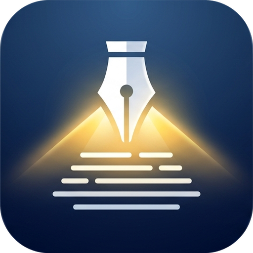

<p align="center">
  
</p>

# InkBeacon

A beacon of light in a “content” world where reading is hard-to-navigate.

A space for studying your own texts: read chapter by chapter, highlight
sentences, build a Mermaid diagram for each chapter and track the progress of
every course. Study state syncs to a private store, protected by a personal
key.

Built with Next.js, Tailwind and Vercel Blob.

## How it works

- **Courses and books** are managed from the **Library** page (`/library`):
  add a book, edit titles and courses, move or delete books. The list is
  stored in the private store (`studio/registry.json`); `lib/courses.ts` only
  fills it the first time.
- **Books** don't live in the repository. The library page converts an EPUB
  or a single-file HTML export in your browser and uploads it straight to a
  private Vercel Blob store. The app shows a book only after you've entered
  the key.
- **Your study** (highlights, diagrams, progress) is saved to the same store,
  in `studio/state.json`.
- **`GET /api/progress`** returns the percentages per course, with
  `Authorization: Bearer <STUDIO_ACCESS_KEY>`. It's there to show them
  elsewhere (on a display, for example).

## Getting started

You need Node.js 22.13 or later.

```bash
npm install
cp .env.example .env.local   # then pick a long, random key
npm run dev
```

To sync and read books you need a private Blob store: create it from the
Vercel dashboard, connect it to the project and pull the variables with
`vercel env pull .env.local`. Add `STUDIO_ACCESS_KEY` to the project's
variables on Vercel too.

## Adding a book

Open **Library** (linked from the home page), enter the key, choose an EPUB
or a single-file HTML export (Calibre style: the `.html` alone, or a `.zip` of
its folder to keep the images), check the title, author and course, and press
**Convert and upload**. Chapter and part headings are recognised in English
("Chapter 3", "Part II") and Italian ("Capitolo 3", "Parte II").

Deleting a book from the library removes its text, images, highlights,
diagrams and progress, after you type its id to confirm.

### From the command line

For bulk imports, the same conversion runs in Python, into `data-private/`
(which git ignores), and a script uploads the result:

```bash
python3 scripts/import-epub.py book.epub --id my-book \
    --title "Title" --author "Author"
python3 scripts/import-single-html.py folder/ --id my-book \
    --title "Title" --author "Author"

node --env-file=.env.local scripts/upload-book.mjs my-book --course example-course
```

`--pages 240` tracks progress in pages instead of chapters. Without
`--course` the files are uploaded but the book isn't added to the library
(useful to replace the text of a book that's already there).

The three demo books in `examples/books/` match the example courses; to load
them into a new store:

```bash
mkdir -p data-private/books
cp examples/books/*.json data-private/books/
for id in example study-notes slow-reading; do
  node --env-file=.env.local scripts/upload-book.mjs "$id"
done
```

Only upload texts you have the right to use: the store is private, but books
remain copyrighted works.

## AI disclaimer

This code was automated in various steps, but with inspection so close I
wouldn't personally consider it "vibe-coding". That said, many issues were
solved with the use of models from Anthropic, OpenAI, and local-running Qwen.
